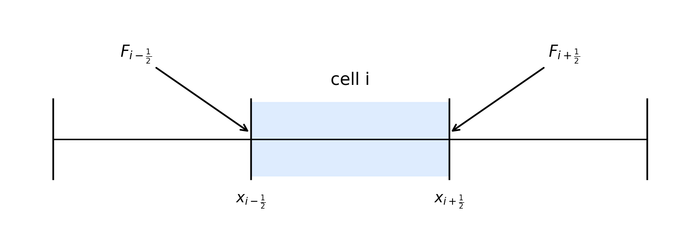
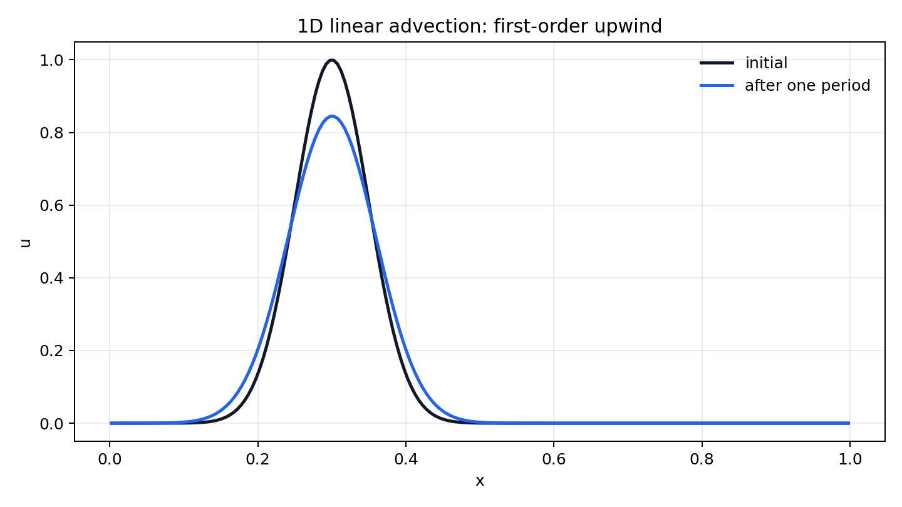
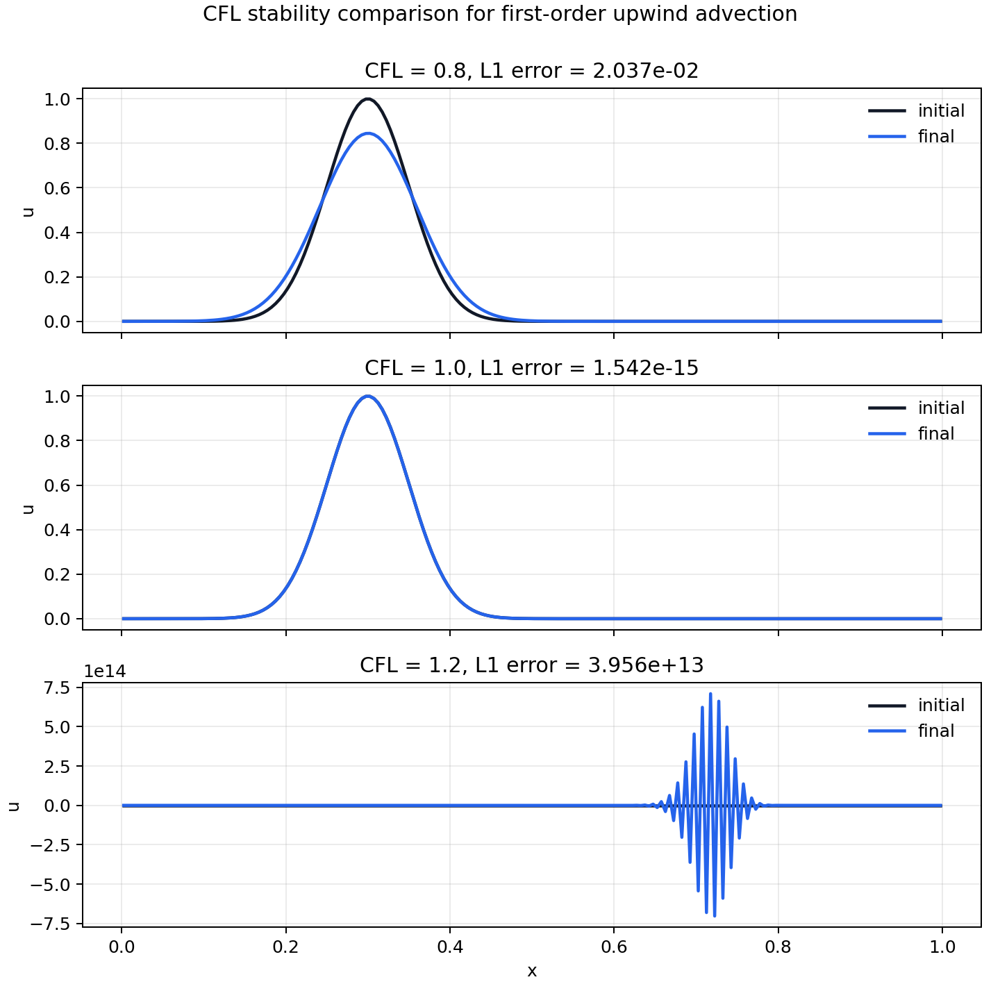
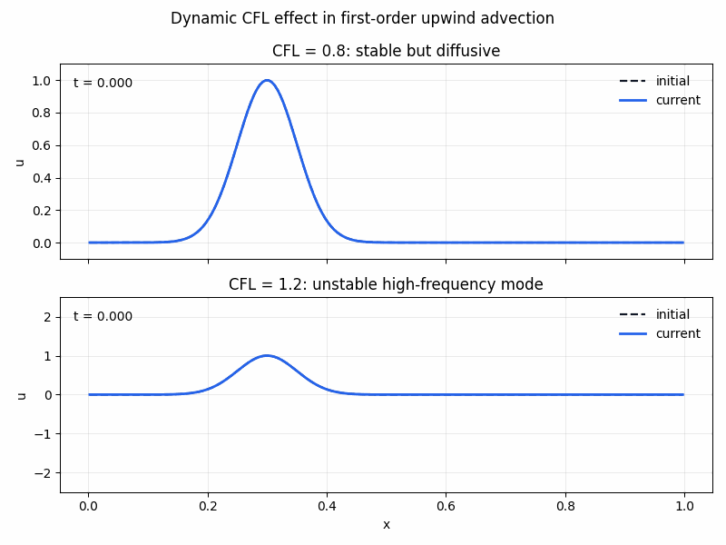

# 第一周：有限体积法与一维对流

## 1. 从求解器角度理解守恒律

一维守恒律写成：

$$
\frac{\partial u}{\partial t}
+
\frac{\partial f(u)}{\partial x}
=
0 .
$$

不要先把它看成抽象偏微分方程，而要读成一句物理话：

> 控制体内部的守恒量之所以变化，只能是因为通量从边界流入或流出。

对于第 \(i\) 个 cell，有限体积更新公式是：

$$
U_i^{n+1}
=
U_i^n
-
\frac{\Delta t}{\Delta x}
\left(
F_{i+\frac12} - F_{i-\frac12}
\right).
$$

符号含义：

- \(U_i^n\)：第 \(i\) 个 cell 在第 \(n\) 个时间步的单元平均值。
- \(\Delta t\)：时间步长。
- \(\Delta x\)：cell 宽度。
- \(F_{i-\frac12}\)：穿过 cell 左界面的数值通量。
- \(F_{i+\frac12}\)：穿过 cell 右界面的数值通量。

几何图像如下：



关键直觉：

> 通量差乘以 \(\Delta t\) 给出 cell 内总量的变化；再除以 \(\Delta x\)，是把总量变化换算成单元平均值变化。

如果直接更新总量 \(Q_i\)，公式是：

$$
Q_i^{n+1}
=
Q_i^n
-
\Delta t
\left(
F_{i+\frac12} - F_{i-\frac12}
\right).
$$

因为求解器通常存的是平均值：

$$
Q_i = U_i\Delta x,
$$

所以换成 \(U_i\) 的更新公式后，自然会出现 \(\Delta x\)。

## 2. 第一个模型问题：线性对流

一维线性对流方程是：

$$
\frac{\partial u}{\partial t}
+
a \frac{\partial u}{\partial x}
=
0,
$$

其中 \(a\) 是波速。

它也可以写成守恒形式：

$$
\frac{\partial u}{\partial t}
+
\frac{\partial (au)}{\partial x}
=
0.
$$

因此通量是：

$$
f(u) = au.
$$

当 \(a > 0\) 时，信息从左往右传播，所以界面 \(i+\frac12\) 的迎风通量取左侧 cell 的值：

$$
F_{i+\frac12}
=
a U_i .
$$

代入有限体积更新公式，得到：

$$
U_i^{n+1}
=
U_i^n
-
\frac{a\Delta t}{\Delta x}
\left(
U_i^n - U_{i-1}^n
\right).
$$

定义 CFL 数：

$$
\mathrm{CFL}
=
\frac{|a|\Delta t}{\Delta x}.
$$

CFL 的物理意义是：

> 一个时间步内，信息走过了几个网格宽度。

对于一阶迎风格式，一个安全条件是：

$$
\mathrm{CFL} \le 1 .
$$

## 3. 公式和代码的对应关系

数学公式：

$$
U_i^{n+1}
=
U_i^n
-
\frac{\Delta t}{\Delta x}
\left(
F_{i+\frac12} - F_{i-\frac12}
\right)
$$

在代码中对应：

```python
u = u - dt / dx * (flux_right - flux_left)
```

对于周期边界且 \(a > 0\) 的情况，cell \(i\) 的左邻居是 cell \(i-1\)。在边界处，左邻居通过周期边界绕回到数组另一端。

## 4. 一阶迎风格式的结果

高斯波包经过一个周期后，理论上应该回到原位置并保持形状不变。

实际一阶迎风结果如下：



可以观察到：

- 波包位置基本回到原处，说明传播速度大体正确。
- 波峰变低，波形变宽，说明存在数值耗散。

这不是代码错误，而是一阶迎风格式的性质。后续会用 MUSCL 重构、限制器和更高阶格式来减小这种耗散。

## 5. CFL 与稳定性

当 \(a>0\) 时，一阶迎风更新可以写成：

$$
U_i^{n+1}
=
U_i^n
-
\mathrm{CFL}
\left(
U_i^n - U_{i-1}^n
\right).
$$

等价地：

$$
U_i^{n+1}
=
(1-\mathrm{CFL})U_i^n
+
\mathrm{CFL}U_{i-1}^n .
$$

如果：

$$
0 \le \mathrm{CFL} \le 1,
$$

这个公式是正常加权平均。新值会落在当前 cell 和上游 cell 的旧值之间，不会凭空制造新的极大值或极小值。

如果：

$$
\mathrm{CFL} > 1,
$$

则系数 \(1-\mathrm{CFL}\) 变成负数。此时更新不再是插值，而是外推。外推容易产生过冲、欠冲，并放大小误差。

CFL 的定义再次写为：

$$
\mathrm{CFL}
=
\frac{|a|\Delta t}{\Delta x}.
$$

所以 CFL 表示一个时间步内信息跨过的 cell 数。对于一阶迎风格式，一个时间步只看一个上游 cell；如果信息在一个时间步内跨过超过一个 cell，就会超出这个格式能可靠处理的范围。

静态对比图如下：



打开 CFL 稳定性对比图窗口：

```powershell
python .\cfd-learning\scripts\compare_cfl_stability.py
```

只有需要保存 PNG 时才使用：

```powershell
python .\cfd-learning\scripts\compare_cfl_stability.py --save
```

同样的现象也可以用动态动画观察：



打开动态窗口：

```powershell
python .\cfd-learning\scripts\animate_cfl_advection.py
```

只有需要保存 GIF 时才使用：

```powershell
python .\cfd-learning\scripts\animate_cfl_advection.py --save
```

动画中的不稳定算例故意加入了极小的高频扰动。这是因为 CFL 不稳定具有模态相关性：光滑的高斯波包在短时间内可能看起来还可以，但当 \(\mathrm{CFL}>1\) 时，小尺度高频误差会被放大。

## 6. 数值耗散与数值扩散

线性对流方程的精确解只是平移：

$$
u(x,t)
=
u(x-at,0).
$$

也就是说，原方程只要求波形搬家，不要求波形变矮、变宽或变钝。

但一阶迎风格式在 \(\mathrm{CFL}<1\) 时会把相邻 cell 的值混合。例如：

$$
\mathrm{CFL}=0.8
$$

时：

$$
U_i^{n+1}
=
0.2U_i^n
+
0.8U_{i-1}^n.
$$

这相当于每一步都在做一点混合。混合会抹平差异，因此波峰降低、波形变宽。这种原方程没有要求、但由数值格式引入的抹平效应，叫做数值耗散。

在当前问题中，数值耗散主要表现为数值扩散。可以把它理解为：

> 扩散是把尖锐结构抹平；耗散是把小尺度强度吃掉。一阶迎风格式里的耗散主要就是扩散。

如果：

$$
\mathrm{CFL}=1.0,
$$

则：

$$
U_i^{n+1}
=
U_{i-1}^n.
$$

在一维线性对流、常速度、均匀网格、周期边界这个特殊问题中，这等价于数组整体平移一个 cell，所以几乎不耗散。

但这只是特殊情形。真实 CFD 中存在非线性、多维、非均匀网格、边界条件和局部波速变化，不能简单认为 \(\mathrm{CFL}=1\) 就一定无耗散或最优。
