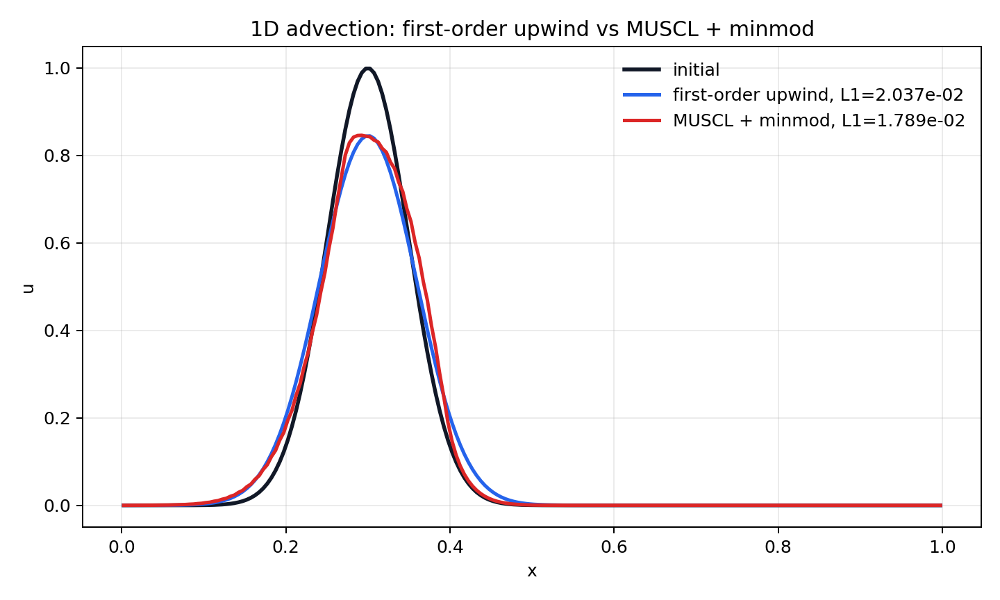

# 第二周：MUSCL 二阶重构入门

## 1. 为什么需要重构

一阶迎风格式把每个 cell 内部看成常数：

$$
u_i(x) = U_i.
$$

这叫分片常数重构。它简单、稳定，但界面值很粗糙，因此数值耗散明显。

MUSCL 的基本思想是：

> 在每个 cell 内部重构一条斜线，而不是把 cell 看成一整块平板。

也就是：

$$
u_i(x)
=
U_i
+
\sigma_i (x-x_i),
$$

其中：

- \(U_i\)：cell 平均值。
- \(x_i\)：cell 中心。
- \(\sigma_i\)：cell 内部斜率。

## 2. 从 cell 平均值推到界面值

有了斜率之后，cell \(i\) 在右界面 \(i+\frac12\) 的左状态为：

$$
U_{i+\frac12}^{L}
=
U_i
+
\frac12 \Delta x \sigma_i.
$$

在左界面 \(i-\frac12\) 的右状态为：

$$
U_{i-\frac12}^{R}
=
U_i
-
\frac12 \Delta x \sigma_i.
$$

对于线性对流且 \(a>0\)，信息从左往右传播，所以界面通量使用左状态：

$$
F_{i+\frac12}
=
aU_{i+\frac12}^{L}.
$$

这比一阶迎风的

$$
F_{i+\frac12}=aU_i
$$

更精确，因为它使用的是重构到界面的值。

## 3. 为什么需要限制器

如果直接用中心斜率：

$$
\sigma_i
=
\frac{U_{i+1}-U_{i-1}}{2\Delta x},
$$

在光滑区域很准确，但在间断、激波或尖锐梯度附近容易产生过冲和振荡。

限制器的目标是：

> 光滑区域尽量保持二阶精度；间断附近自动减小斜率，避免非物理振荡。

本节使用 `minmod` 限制器：

$$
\operatorname{minmod}(a,b)
=
\begin{cases}
\operatorname{sign}(a)\min(|a|,|b|), & ab>0, \\
0, & ab\le 0.
\end{cases}
$$

对应斜率为：

$$
\sigma_i
=
\operatorname{minmod}
\left(
\frac{U_i-U_{i-1}}{\Delta x},
\frac{U_{i+1}-U_i}{\Delta x}
\right).
$$

直觉是：

- 如果左右斜率同号，说明局部趋势一致，保留较小斜率。
- 如果左右斜率异号，说明附近可能有极值或间断，把斜率压成 0。

## 4. 代码对应关系

斜率限制器：

```python
backward = (u - np.roll(u, 1)) / dx
forward = (np.roll(u, -1) - u) / dx
slope = minmod(backward, forward)
```

右界面左状态：

```python
left_state_at_right_face = u + 0.5 * dx * slope
```

对 \(a>0\) 的线性对流，通量为：

```python
flux_right = a * left_state_at_right_face
```

有限体积更新仍然是：

```python
u = u - dt / dx * (flux_right - flux_left)
```

注意：MUSCL 改的是界面状态的获得方式，有限体积守恒更新骨架没有变。

实际代码中还使用了 TVD RK2 时间推进。原因是：只把空间离散升级到二阶，但时间推进仍用一阶 Euler，可能导致整体格式不稳定或精度不匹配。

TVD RK2 可以写成：

$$
U^{(1)}
=
U^n
+
\Delta t L(U^n),
$$

$$
U^{n+1}
=
\frac12 U^n
+
\frac12
\left[
U^{(1)}
+
\Delta t L(U^{(1)})
\right],
$$

其中 \(L(U)\) 表示有限体积空间离散算子。

## 5. 一阶迎风与 MUSCL 对比

运行：

```powershell
python .\cfd-learning\scripts\compare_upwind_muscl.py
```

只有需要保存 PNG 时才使用：

```powershell
python .\cfd-learning\scripts\compare_upwind_muscl.py --save
```

得到：



应该观察到：

- MUSCL 的波峰更高，波形更接近初始解。
- 一阶迎风波峰更低、波形更宽，耗散更强。
- `minmod` 比较保守，因此它减少耗散，但不会像无限制高阶格式那样激进。

## 6. 本节核心逻辑

```text
一阶迎风
-> 分片常数重构
-> 稳定但耗散大

MUSCL
-> 分片线性重构
-> 界面值更准确
-> 光滑区域耗散更小
-> 间断附近需要 limiter 防振荡
```

## 7. 耗散误差与相位误差诊断

只看波峰高度不足以判断格式好坏。至少要同时看：

- 波峰高度：主要反映幅值耗散。
- 波峰位置：主要反映相位误差，也叫色散误差的一种表现。
- 整体形状：同时包含耗散和色散影响。
- 积分守恒量：有限体积格式必须优先保证。

诊断脚本：

```powershell
python .\cfd-learning\scripts\diagnose_peak_error.py
```

只有需要保存 PNG 时才使用：

```powershell
python .\cfd-learning\scripts\diagnose_peak_error.py --save
```

图中会标出每条曲线的：

- `x`：波峰位置。
- `u`：波峰高度。
- `dx`：相对精确波峰位置的偏移。
- `du`：相对精确波峰高度的偏移。

核心判断：

> 耗散看波有没有被抹平；相位误差看波有没有跑错位置。一个格式可能峰值看起来还行，但位置错了；也可能位置对了，但幅值被吃掉。
